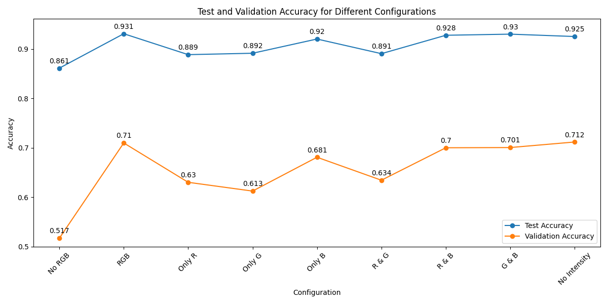

# Neptun's Eye

Neptun's Eye is a simple ML-powered point cloud segmentation tool. The project has been developed by students
from [Czarna Magia Student Artificial Intelligence Society](https://github.com/knsiczarnamagia) and students from University of Warmia and Mazury
under the mentorship of [Visimind](https://visimind.com/pl/).

# Latest build
Neptun's Eye v0.1.2
Download [**here**](https://1drv.ms/u/c/d3ea4807286ecc01/Ed1goM6VdShIm4szHry-2DkBs0YLXkzQjoWChxifNOxPEg?e=hLooXh)

### Requirements
- Windows 10 or newer OS
- [**Optional**] Python 3.7.9 for `pptk` support
> [!NOTE]
> The app requires OpenGL 3.3 or newer and might not work correctly on virtual machines or old computers.


# Installation
We packed our app into easy to run executable. You can download and run it right away or dowload some additional tools for more functionalities.
## Ready-to-run build
- Download latest build above.
- Extract the files into a single folder located anywhere convenient for you.
- Locate and execute `main.exe` file in the `dist\main` folder.

That's it! You're good to go!
> [!IMPORTANT]
> Verify if there are models you are using inside `dist\main\_internal\resources\models` folder.

> [!NOTE]
> While our project incorporates visualization tools, it's important to note that they may not support every type of Lidar data. Among them, the pptk package stands out as the most versatile option. However, utilizing it necessitates an additional Python installation, as detailed below.

## More options
<details>
  <summary>Click to see more installation options</summary>
  
### Visualisation with pptk
Our app leverages a swift and efficient point cloud visualization tool in Python `pptk`. To utilize this tool, you'll need to install Python 3.7.9 on your computer and download `pandas` and `pptk` for this specific version using any package management system.

You can download Python 3.7.9 from the official website [here](https://www.python.org/downloads/release/python-379/)

**After you install python you must change the Python 3.7.9 path in the app settings. See how to do that below.**
<details>
  <summary>Click to see how to set up Python 3.7.9 for our app</summary>
  <br>
  
- Locate your python installation. The default location is `%LOCALAPPDATA%/Programs/Python/Python37`
- Make sure you installed `pandas` and `pptk` for Python 3.7.9:
  
```
%LOCALAPPDATA%/Programs/Python/Python37/python.exe -m pip install pandas
%LOCALAPPDATA%/Programs/Python/Python37/python.exe -m pip install pptk
```
- Navigate to the `%LOCALAPPDATA%/Programs/Python/Python37` folder in your system.
- Copy the path from navigation bar e.g. `C:\Users\<YourName>\AppData\Local\Programs\Python\Python37`
- Open the Neptun's Eye app, click settings and paste the path into `python37` variable.
- Change `userprofile_path` to **False**

</details>

### Run with Poetry
  <details>
    <summary>Click to see how to run our app with Poetry</summary>
    <br>

> **Note**: This is for advanced users. We do not recommend this method.
    
- Install `pipx`.
- Install poetry using `pipx` (do not use brew).
- Install `pyenv`. Check if it is installed correctly by running `pyenv --vesion`.
- Create virtual environment using `pyenv` with python 3.11.
- Install `poetry`. Check if it is installed correctly by running `poetry --vesion`.
- Install dependencies using `poetry`.

### Installation Details

Create virtual environment:

```commandline
poetry env use $(pyenv which python)
```

You should see something like this:

```commandline
Using virtualenv: C:\Users\Admin\AppData\Local\pypoetry\Cache\virtualenvs\neptuns-eye-z6EeDWoH-py3.11
```

This command is used for installing dependencies from `requirements.txt` using `poetry`. You will probably not use it
and directly install dependencies from `pyproject.toml` file. This is left here only for reference.

```commandline
poetry add $(cat requirements.txt)
```

#### Run

```commandline
make run
```

#### Test

```commandline
make test
```

#### Reference materials

- [Pyenv](https://realpython.com/intro-to-pyenv/#why-use-pyenv)
- [How install Pyenv?](https://k0nze.dev/posts/install-pyenv-venv-vscode/)
- [Pyenv for windows](https://github.com/pyenv-win/pyenv-win)
- [Poetry](https://realpython.com/dependency-management-python-poetry/#add-poetry-to-an-existing-project)

#### Install `make` on Windows

1. Install [chocolatey](https://chocolatey.org/install)
2. Install make using choco.

```powershell
choco install make
```
  </details>
</details>

# Usage
<details>
  <summary>Click to see the user guide</summary>

### Visualisation and classification
  
  - Launch the Neptun's Eye application.
  - Click the **Select File** button to load your point cloud.
  - If the point cloud loads successfully, select a **Rendering tool**. We recommend using either *Polyscope* or *pptk*.
  - Visualization in Neptun's Eye is designed just for preview purposes. Set the **Rendering stride** to ensure smooth rendering. We recommend generating between 500,000 and 2,000,000 points.
  - Click **Render visualization** and wait for the result. This process may take up to one minute, depending on the size of your point cloud.
  - To perform classification, choose a model from the **Classification options** section. If you're using our models, we recommend *ExtraTrees* or *RandomForest*.
  - To classify the entire point cloud, press the **Run classification** button and wait for the confirmation message. This process duration depends on the point cloud size.
  - To preview model performance, check the **Use stride** box in the **Classification section**. This option will classify points based on the **Rendering stride** selected in the visualization section, saving time and resources.
  
</details>

# Research & ML

During the project a lot of effort has been invested in the data preprocessing. Each dataset that we worked with have
been described by a Dataset Card. It was crucial for the project because it was the first time we have been working with
Point Clouds and `.las` file format.

At the beginning we researched the PointNet and PointNet++ architectures because they are neural networks dedicated for
Point Clouds. During the research we decided to begin with more baseline models. Finally we ended up with using tee
models like **Random Forest** or **Extra Trees Classifier**. The Point Net architecture is planned to be implemented in
the near future.

For experiment tracking we used Weights and Biases, which helped us tremendously with finding the best hyperparameters
for our models. Latter we used also Optuna.

## Data
<details>
  <summary>Click to check out how we processed data</summary>
  
### Classified data:
[WMII.las datacard](datacards/WMII_CLASS%20datacard.md)


[USER AREA.las datacard](datacards/WMII_CLASS%20datacard.md)

### Unclassified data:
[kortowo.las datacard](datacards/kortowo%20datacard.md)

### Data dependencies

#### Corelation matrix of wmii.las with empty columns removed


### Searching for the most significant columns 

#### The impact of given columns on the accuracy of the RandomForestClassifier model
*stride for validation dataset = 30, stride for training dataset = 30, n_estimators = 100*


| Feature             | Set 1 | Set 2 | Set 3 | Set 4 | Set 5 |
|---------------------|-------|-------|-------|-------|-------|
| X                   | ✓     | ✓     |       |       |       |
| Y                   | ✓     | ✓     |       |       |       |
| Z                   | ✓     | ✓     | ✓     | ✓     | ✓     |
| red                 | ✓     | ✓     | ✓     | ✓     | ✓     |
| green               | ✓     | ✓     | ✓     | ✓     | ✓     |
| blue                | ✓     | ✓     | ✓     | ✓     | ✓     |
| intensity           |       | ✓     | ✓     | ✓     |       |
| return_number       |       | ✓     |       | ✓     | ✓     |
| edge_of_flight_line |       | ✓     | ✓     | ✓     |       |
| scan_angle_rank     |       | ✓     |       | ✓     | ✓     |
| number_of_returns   |       |       | ✓     | ✓     | ✓     |

#### the influence of R, G and B columns on the accuracy of the RandomForestClassifier model
*feature_columns = ['Z', 'red', 'green', 'blue', 'intensity','number_of_returns', 'return_number','edge_of_flight_line', 'scan_angle_rank'], training dataset stride = 720, validation dataset stride = 30, n_estimators = 100*



### Searching for dataset minimization

#### The influence of the stride parameter on the accuracy of the RandomForestClassifier model on the training dataset

Note: Stride means that every stride record will be used, it's basically like a step. Stride = 2 means every other record will be selected.

| Stride       | Validation Accuracy |
|--------------|---------------------|
| No stride    | 0.7037              |
| stride = 2   | 0.7039              |
| stride = 5   | 0.7037              |
| stride = 10  | 0.7038              |
| stride = 30  | 0.7035              |
| stride = 60  | 0.7024              |
| stride = 120 | 0.7015              |

Note: Stride higher than 120 will rarely be used.

#### The influence of the stride parameter on the accuracy of the RandomForestClassifier model on the training and validation dataset


### The effect of data scaling on the accuracy of the RandomForestClassifier model
*stride on training dataset = 720, stride on validation dataset = 30, n_estimators = 100*
|                  | Test Accuracy | Validation Accuracy |
|------------------|---------------|---------------------|
| Raw Data         | 0.931131809   | 0.709942897         |
| MinMaxScaler     | 0.930849562   | 0.709571228         |
| Difference       | 0.000282247   | 0.000371669         |

### Impact of normalization of R, G and B columns (divide by 65025) on the accuracy of the RandomForestClassifier model

|                  | Test Accuracy | Validation Accuracy |
|------------------|---------------|---------------------|
| Raw RGB          | 0.931131809   | 0.709942898         |
| Normalized RGB   | 0.859441152   | 0.577975895         |
| Difference       | 0.071690657   | 0.131966998         |

### Comparison of classifiers

| Classifier                      | Test Accuracy | Validation Accuracy | Validation Accuracy from Optuna |
|---------------------------------|---------------|---------------------|---------------------------------|
| AdaBoostClassifier              | 0.8944        | 0.6352              | 0.7681                   |
| BaggingClassifier               | 0.9252        | 0.6893              | 0.7183                          |
| ExtraTreesClassifier            | 0.9303        | **0.7446**          | 0.7655                               |
| GradientBoostingClassifier      | 0.9325        | 0.7183              | 0.7402                               |
| HistGradientBoostingClassifier  | **0.9390**    | 0.7094              | **0.7995**                               |
| KNeighborsClassifier            | 0.8913        | 0.7044              | 0.6992                               |
| RandomForestClassifier          | 0.9311        | 0.7099              | 0.7205                               |
| StackingClassifier              | 0.9385        | 0.7021              | 0.7011                               |
| VotingClassifier                | 0.9359        | 0.7205              | 0,7392                               |


### Correlation matrix of ExtraTreesClassifier


### Models description

#### ExtraTreesClassifier

The ExtraTreesClassifier is an ensemble learning method provided by the scikit-learn library for classification tasks. It stands for Extremely Randomized Trees and operates by constructing a multitude of decision trees during training. Unlike traditional decision trees, ExtraTreesClassifier introduces additional randomness by selecting split points and features at random for each tree. This results in a diverse set of trees, which enhances predictive performance and robustness. The classifier is efficient, can handle large datasets, and provides feature importance scores, helping to identify the most relevant features for the classification task.

#### RandomForestClassifier

The RandomForestClassifier is an ensemble learning method in the scikit-learn library designed for classification tasks. It operates by constructing multiple decision trees during training and combines their outputs to determine the final class prediction. This approach improves predictive performance and controls over-fitting by averaging the results of individual trees, each trained on random subsets of the data and features. The classifier is robust, handling missing values and noisy data effectively, and can scale well with large datasets. Additionally, it provides estimates of feature importance, helping to identify which features are most influential in making predictions. 

#### HistGradientBoostingClassifier

The HistGradientBoostingClassifier is a machine learning model provided by the scikit-learn library in Python. It is a type of gradient boosting algorithm that uses histograms to speed up the training process. This classifier is designed for supervised learning tasks, specifically classification problems. It works by building an ensemble of decision trees in a stage-wise manner and optimizing for a loss function. The histogram-based approach allows it to handle large datasets efficiently, making it faster and more scalable compared to traditional gradient boosting methods.


</details>

# Used stack

- **ML:** Sklearn, Pandas, Laspy
- **Experiment Tracking:** Weights and Biases, Optuna
- **GUI:** customtkinter
- **Point cloud visualisation:** pptk, polyscope, plotly
- **Version Control:** Git & GitHub
- **Project Organization:** GitHub Projects

# License

This project is licensed under the [MIT License](LICENSE).

# Neptun's Eye Team

**GUI & App:**
- [Nikodem Przybyszewski](https://github.com/nexter0)
  
**ML team:**
- [Michał Sztymelski](https://github.com/Stimm147)
- [Kacper Gutowski](https://github.com/Perunio)
- [Jan Karaś](https://github.com/KTFish)
  
**Assistant**
- [Alan Ferenc](https://github.com/Zeusthegoddd)

