### Data types and description

| Exact Name        | Data Type | Description                                                  |
|-------------------|-----------|--------------------------------------------------------------|
| X                 | float64     | Positional value                                             |
| Y                 | float64     | Positional value                                             |
| Z                 | float64     | Positional value                                             |
| intensity         | uint16    | The return strength of the laser pulse that generated the lidar point |
| return_number     | int32     | An emitted laser pulse can have multiple returns. This marks the order of the return |
| number_of_returns | int32     | Total number of returns for a given pulse                    |
| scan_direction_flag | int32     | Direction the laser scanning mirror was traveling at the time of the laser pulse |
| edge_of_flight_line | uint8     | Points at the edge of the flight line are given a value of 1; all others are 0 |
| classification   | int32     | Numeric integer codes defining the type of object that reflected the laser pulse |
| synthetic        | int32     | Points created by methods other than lidar collection        |
| key_point        | int32     | A point considered to be a model key-point                   |
| withheld         | int32     | Points that should not be included in processing             |
| scan_angle_rank  | int8      | Value in degrees between -90 and +90 indicating the laser pulse's direction relative to the aircraft |
| user_data        | uint8     | N/A                                                          |
| point_source_id  | uint16    | N/A                                                          |
| red              | uint16    | Red band value for lidar data attributed with RGB bands      |
| green            | uint16    | Green band value for lidar data attributed with RGB bands    |
| blue             | uint16    | Blue band value for lidar data attributed with RGB bands     |

**If you want to see detailed description of las files go [here](detailed_las_data_information.md)**

## USER AREA.las
USER AREA.las is a fragment of Słoneczna street (hole roads leading to wmii).

| Attribute             | Unique Values | Min Value  | Max Value   | Mean Value   | Median Value | Std Value    |
|-----------------------|---------------|------------|-------------|--------------|--------------|--------------|
| X                     | 56632         | -1690300   | 699         | -869617.32   | -855190.0    | 415378.86    |
| Y                     | 22782         | -947100    | 372500      | -250536.68   | -237199.0    | 275937.13    |
| Z                     | 11788         | -35199     | 2076400     | 37069.63     | 17610.0      | 51632.39     |
| intensity             | 2090          | 10         | 37003       | 11735.05     | 12812.0      | 4176.02      |
| return_number         | 3             | 1          | 3           | 1.35         | 1.0          | 0.72         |
| number_of_returns     | 2             | 1          | 3           | 1.71         | 1.0          | 0.96         |
| scan_direction_flag   | 1             | 0          | 0           | 0.0          | 0.0          | 0.0          |
| edge_of_flight_line   | 2             | 0          | 1           | 0.0          | 0.0          | 0.03         |
| classification        | 8             | 0          | 25          | 12.43        | 11.0         | 2.77         |
| synthetic             | 1             | 0          | 0           | 0.0          | 0.0          | 0.0          |
| key_point             | 1             | 0          | 0           | 0.0          | 0.0          | 0.0          |
| withheld              | 1             | 0          | 0           | 0.0          | 0.0          | 0.0          |
| scan_angle_rank       | 76            | -38        | 37          | -2.33        | -3.0         | 19.72        |
| user_data             | 1             | 0          | 0           | 0.0          | 0.0          | 0.0          |
| point_source_id       | 1             | 0          | 0           | 0.0          | 0.0          | 0.0          |
| red                   | 255           | 0          | 65278       | 24117.83     | 22873.0      | 9991.81      |
| green                 | 255           | 0          | 65278       | 22556.78     | 21588.0      | 8483.26      |
| blue                  | 255           | 0          | 65278       | 10336.84     | 7967.0       | 9300.42      |

### Data features
Point count: 6215173

Return number: 

| Value | Frequency   |
|-------|-------------|
| 1     | 4,922,896   |
| 3     | 893,683     |
| 2     | 398,594     |

Number of returns: 

| Value | Frequency   |
|-------|-------------|
| 1     | 4,001,189   |
| 3     | 2,213,984   |

Edge of flight line:

| Value | Frequency   |
|-------|-------------|
| 0     | 6,208,309   |
| 1     | 6,864       |

Classification:

| Value | Frequency   |
|-------|-------------|
| 11    | 3,418,176   |
| 13    | 2,102,971   |
| 0     | 517         |
| 15    | 193,239     |
| 17    | 277,429     |
| 19    | 12,387      |
| 25    | 177,455     |
| 1     | 32,999      |

### Data visualization

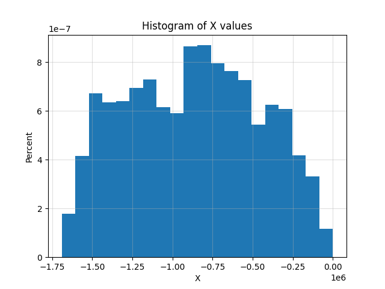
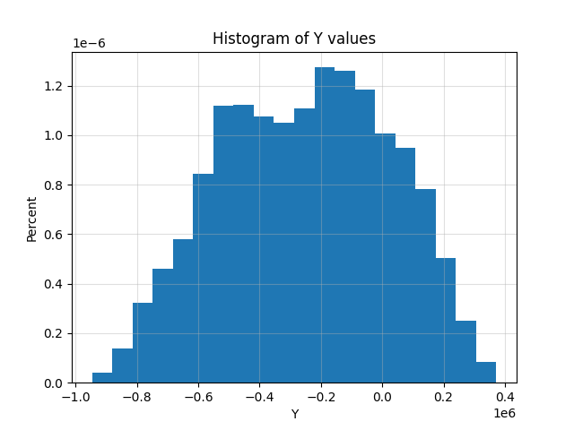
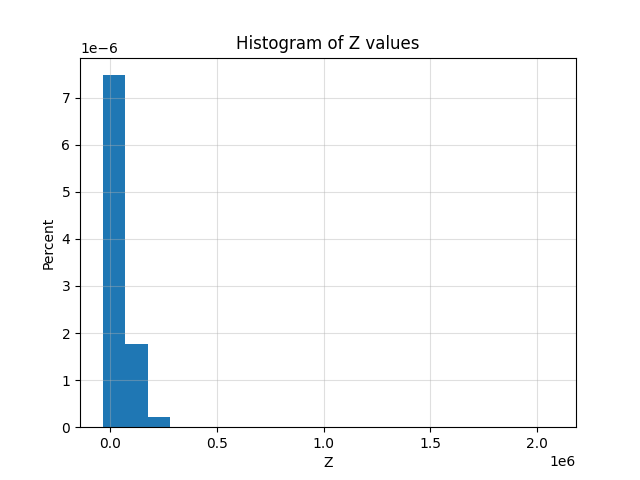
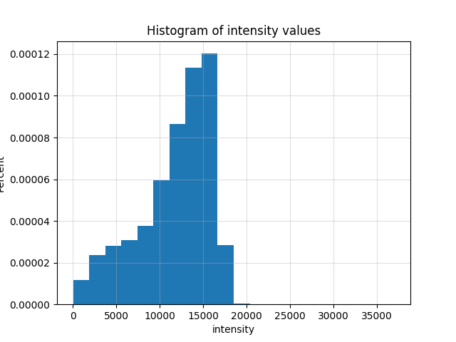
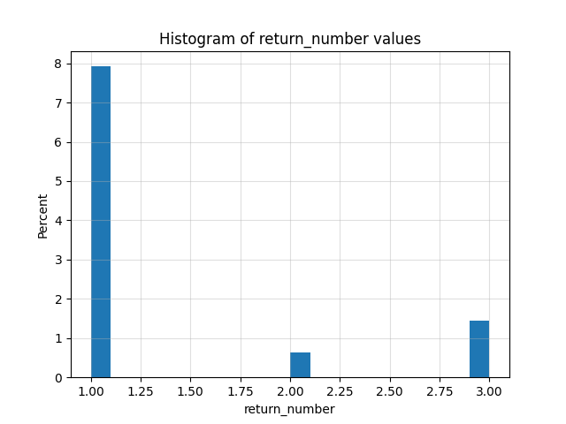
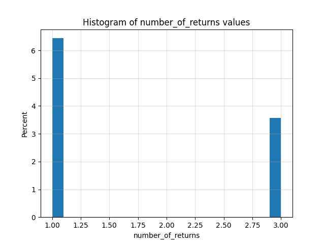
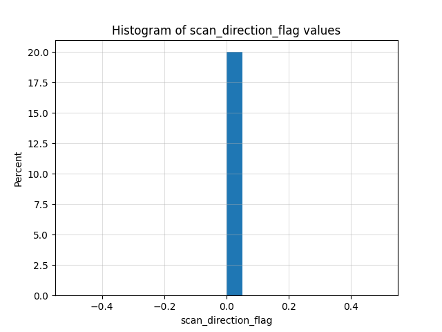
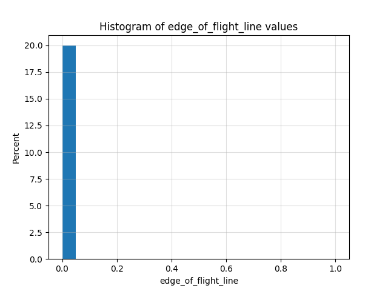
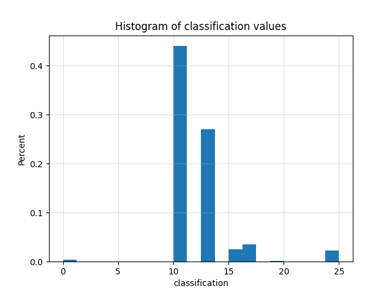
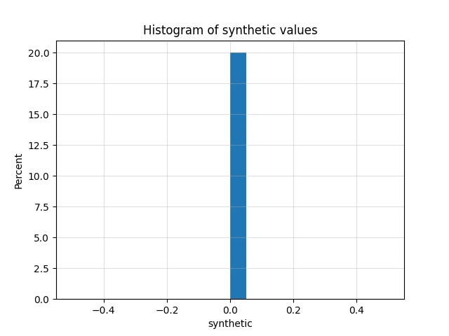

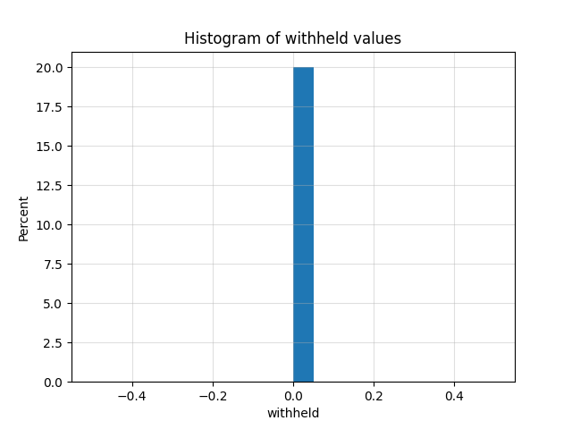
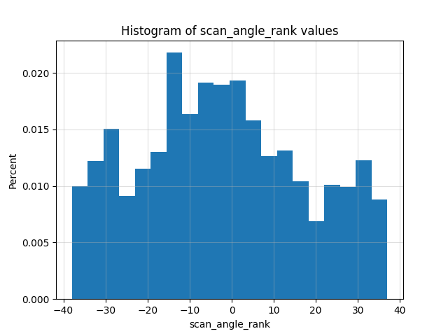
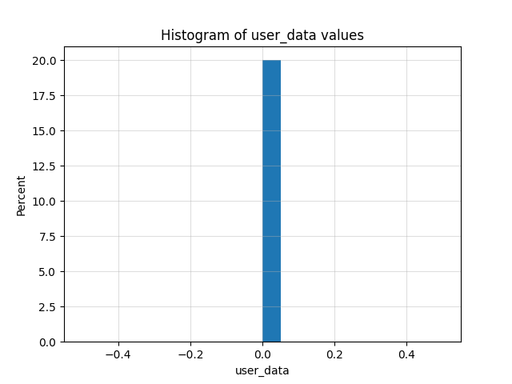
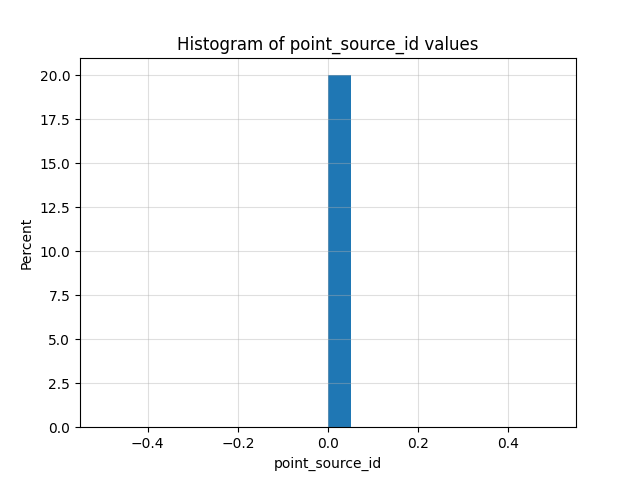
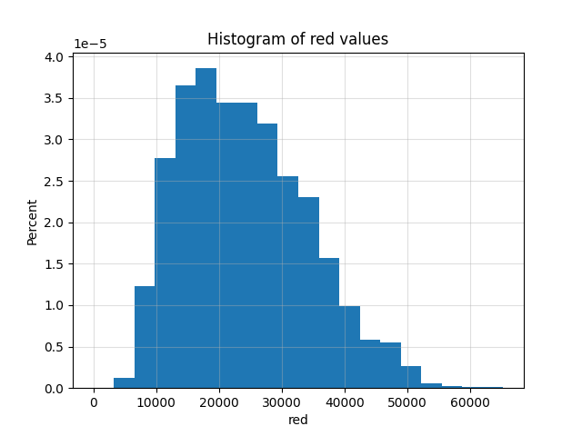
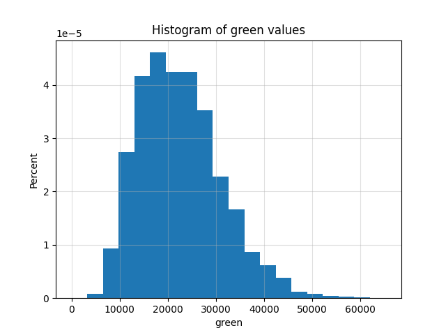
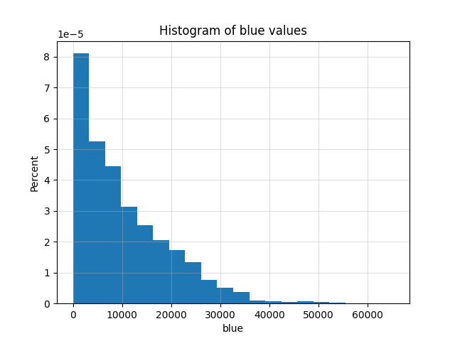

