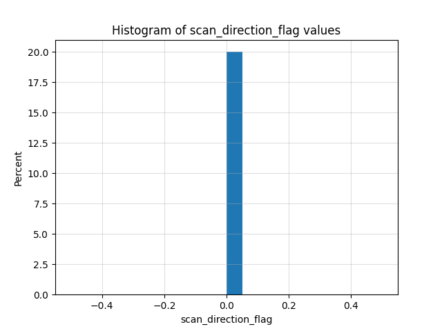
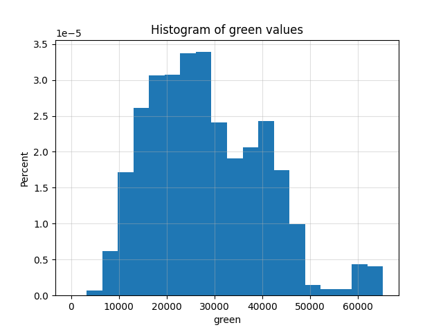

### Data types and description

| Exact Name        | Data Type | Description                                                  |
|-------------------|-----------|--------------------------------------------------------------|
| X                 | float64     | Positional value                                             |
| Y                 | float64     | Positional value                                             |
| Z                 | float64     | Positional value                                             |
| intensity         | uint16    | The return strength of the laser pulse that generated the lidar point |
| return_number     | int32     | An emitted laser pulse can have multiple returns. This marks the order of the return |
| number_of_returns | int32     | Total number of returns for a given pulse                    |
| scan_direction_flag | int32     | Direction the laser scanning mirror was traveling at the time of the laser pulse |
| edge_of_flight_line | uint8     | Points at the edge of the flight line are given a value of 1; all others are 0 |
| classification   | int32     | Numeric integer codes defining the type of object that reflected the laser pulse |
| synthetic        | int32     | Points created by methods other than lidar collection        |
| key_point        | int32     | A point considered to be a model key-point                   |
| withheld         | int32     | Points that should not be included in processing             |
| scan_angle_rank  | int8      | Value in degrees between -90 and +90 indicating the laser pulse's direction relative to the aircraft |
| user_data        | uint8     | N/A                                                          |
| point_source_id  | uint16    | N/A                                                          |
| red              | uint16    | Red band value for lidar data attributed with RGB bands      |
| green            | uint16    | Green band value for lidar data attributed with RGB bands    |
| blue             | uint16    | Blue band value for lidar data attributed with RGB bands     |

**If you want to see detailed description of las files go [here](detailed_las_data_information.md)**

## WMII_CLASS.las

WMII.las is a point cloud that represents the faculty of mathematics and computer science at the University of Warmia and Mazury in Olsztyn.

### Data features

Point count: 6375629

| Feature               | Unique Values | Min Value | Max Value | Mean Value | Median Value | Std Value   |
|-----------------------|---------------|-----------|-----------|------------|--------------|-------------|
| X                     | 29783         | -10399    | 1805300   | 923767.0   | 955100.0     | 384899.73   |
| Y                     | 27647         | -437599   | 1436500   | 481229.23  | 459399.0     | 461857.01   |
| Z                     | 8038          | -153290   | 1689709   | 11679.5    | -18389.0     | 73511.46    |
| Intensity             | 2714          | 10        | 49977     | 12050.97   | 13006.0      | 3842.38     |
| Return Number         | 3             | 1         | 3         | 1.25       | 1.0          | 0.62        |
| Number of Returns     | 2             | 1         | 3         | 1.52       | 1.0          | 0.88        |
| Scan Direction Flag   | 1             | 0         | 0         | 0.0        | 0.0          | 0.0         |
| Edge of Flight Line   | 2             | 0         | 1         | 0.0        | 0.0          | 0.03        |
| Classification        | 8             | 0         | 25        | 16.5       | 15.0         | 5.8         |
| Synthetic             | 1             | 0         | 0         | 0.0        | 0.0          | 0.0         |
| Key Point             | 1             | 0         | 0         | 0.0        | 0.0          | 0.0         |
| Withheld              | 1             | 0         | 0         | 0.0        | 0.0          | 0.0         |
| Scan Angle Rank       | 76            | -38       | 37        | -8.99      | -15.0        | 21.89       |
| User Data             | 1             | 0         | 0         | 0.0        | 0.0          | 0.0         |
| Point Source ID       | 1             | 0         | 0         | 0.0        | 0.0          | 0.0         |
| Red                   | 255           | 0         | 65278     | 30586.61   | 29041.0      | 12719.36    |
| Green                 | 255           | 0         | 65278     | 28387.99   | 26728.0      | 11927.79    |
| Blue                  | 255           | 0         | 65278     | 19756.12   | 17476.0      | 13781.5     |

### Number of individual values
Return Number:

| Value | Frequency   |
|-------|-------------|
| 1     | 5384103     |
| 3     | 628143      |
| 2     | 363383      |

Number of returns:

| Value | Frequency   |
|-------|-------------|
| 1     | 4721515     |
| 3     | 1654114     |

Edge of Flight Line:

| Value | Frequency   |
|-------|-------------|
| 0     | 6368465     |
| 1     | 7164        |

Classification:

| Value | Frequency |
|-------|-----------|
| 11    | 1452334   |
| 13    | 1581882   |
| 25    | 1884562   |
| 0     | 4521      |
| 1     | 46760     |
| 15    | 1199369   |
| 17    | 205686    |
| 19    | 515       |

### Data visualization

