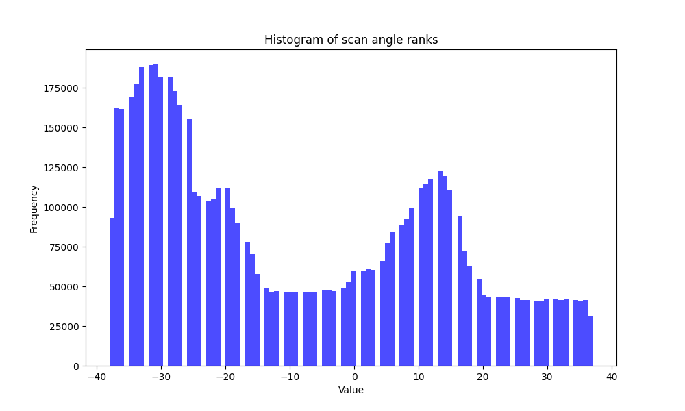

# Dataset card

### Data types and description

| Exact Name        | Data Type | Description                                                  |
|-------------------|-----------|--------------------------------------------------------------|
| X                 | float64     | Positional value                                             |
| Y                 | float64     | Positional value                                             |
| Z                 | float64     | Positional value                                             |
| intensity         | uint16    | The return strength of the laser pulse that generated the lidar point |
| return_number     | int32     | An emitted laser pulse can have multiple returns. This marks the order of the return |
| number_of_returns | int32     | Total number of returns for a given pulse                    |
| scan_direction_flag | int32     | Direction the laser scanning mirror was traveling at the time of the laser pulse |
| edge_of_flight_line | uint8     | Points at the edge of the flight line are given a value of 1; all others are 0 |
| classification   | int32     | Numeric integer codes defining the type of object that reflected the laser pulse |
| synthetic        | int32     | Points created by methods other than lidar collection        |
| key_point        | int32     | A point considered to be a model key-point                   |
| withheld         | int32     | Points that should not be included in processing             |
| scan_angle_rank  | int8      | Value in degrees between -90 and +90 indicating the laser pulse's direction relative to the aircraft |
| user_data        | uint8     | N/A                                                          |
| point_source_id  | uint16    | N/A                                                          |
| red              | uint16    | Red band value for lidar data attributed with RGB bands      |
| green            | uint16    | Green band value for lidar data attributed with RGB bands    |
| blue             | uint16    | Blue band value for lidar data attributed with RGB bands     |

**If you want to see detailed description of las files go [here](detailed_las_data_information.md)**

## kortowo.las
kortowo.las represents a fragment of the kortowo district in Olsztyn.
### Data features

**Point count**: 122,973,708

| Attribute            | Num of unique values | Min Value  | Max Value  | Median Value | Std Value   |
|----------------------|---------------|------------|------------|--------------|-------------|
| X                    | 131984        | -3825800   | 5020799    | 303599.0     | 2162246.29  |
| Y                    | 115503        | -9516200   | 1143099    | -5820300.0   | 2816468.48  |
| Z                    | 61367         | -200449    | 2210610    | 43320.0      | 102688.18   |
| intensity            | 3784          | 10         | 51777      | 12344.0      | 4293.94     |
| return_number        | 3             | 1          | 3          | 1.0          | 0.76        |
| number_of_returns    | 2             | 1          | 3          | 1.0          | 0.99        |
| scan_direction_flag  | 1             | 0          | 0          | 0.0          | 0.0         |
| edge_of_flight_line  | 2             | 0          | 1          | 0.0          | 0.03        |
| classification       | 1             | 1          | 1          | 1.0          | 0.0         |
| synthetic            | 1             | 0          | 0          | 0.0          | 0.0         |
| key_point            | 1             | 0          | 0          | 0.0          | 0.0         |
| withheld             | 1             | 0          | 0          | 0.0          | 0.0         |
| scan_angle_rank      | 76            | -38        | 37         | -5.0         | 17.97       |
| user_data            | 1             | 0          | 0          | 0.0          | 0.0         |
| point_source_id      | 1             | 0          | 0          | 0.0          | 0.0         |
| red                  | 255           | 0          | 65278      | 23387.0      | 11288.85    |
| green                | 255           | 0          | 65278      | 21845.0      | 10113.28    |
| blue                 | 255           | 0          | 65278      | 8481.0       | 11418.01    |

|   | number_of_returns count   |
|------------|-----------|
| Ones    | 71,287,100 |
| Twos     | 51,686,608 |

|   | edge_of_flight_line count   |
|------------|----------|
| Ones    | 99,848    |
| Twos       | 122,873,860|

|   | return_number_count    |
|------------|-----------|
| Ones    | 91,552,970 |
| Twos     | 11,314,728   |
| Threes     | 20,106,010   |

### Data visualization

 
 
 
 
 
 
 
 
 